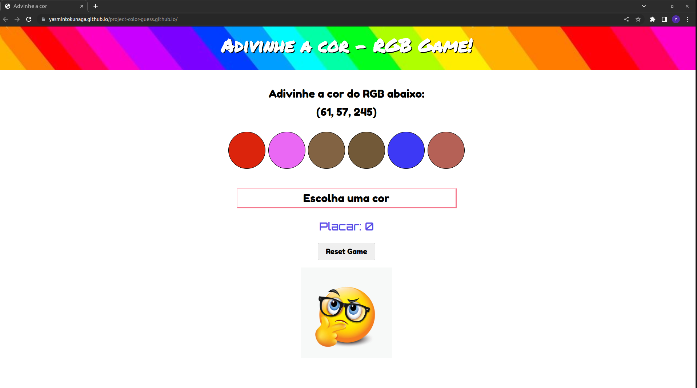

# Projeto Color Guess

Projeto realizado durante o curso de Desenvolvimento Web na Trybe em Dezembro, 2022.

# Conhecimentos técnicos utilizados: 

* HTML, 
* CSS, 
* JavaScript (DOM, seletores, eventos).

# Objetivo:

Criar um jogo que gere aleatoriamente um código de cor RGB e de acordo com esse código o usuário deverá adivinhar qual é a cor que corresponde na paleta.

# Requisitos:

* Gerar um código de cor RGB de forma aleatória
* Gerar uma paleta de 6 corer de forma aleatório, sendo que uma das cores deverá corresponder ao código RGB gerado
* Quando o usuário selecionar uma cor da paleta, gerar uma mensagem avisando se acertou a cor correspondente ao código RGB
* Criar um placar somando os pontos toda ves que o usuário selecionar a cor correta
* Botão Reset Game para gerar uma nova paleta de cores e um novo código RGB.

# Resultado:

